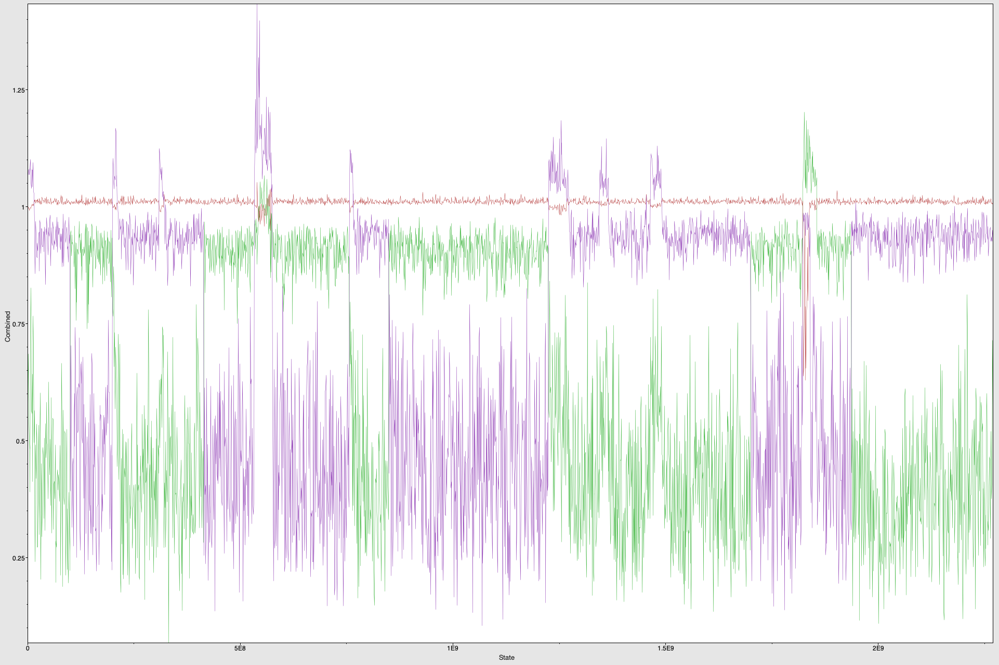

```{r setup, include=FALSE}
## Set chunk settings
knitr::opts_chunk$set(echo = FALSE, 
                      message=FALSE, 
                      warning = FALSE)

library(tidyverse)
library(vroom)
library(knitr)
```

## Introduction
### Overview
Herd immunity is achieved against a disease when a large enough portion of the susceptible population becomes immune to the disease, either by vaccination or contagion, thereby opposing the flow of the disease through the population. For SARS-CoV-2 the critical portion of the population ($p_{crit}$) has been estimated to be around 60 to 70 percent but it is unclear if this estimate took population structure into account [@news_1]. In a structured population setting there would be a critical value $p_{i}$ for each subpopulation describing the number of individuals that should be immunized in each subpopulation to bring the effective reproductive number ($R_e$) below 1. Naturally there could be multiple combinations of $p_{i}$ that could accomplish this. Therefore the existence of subpopulations that are more prone to contract and/or spread SARS-CoV-2 would potentially change the way in which we design vaccination campaigns since the immunization of hyper-spreaders would have a larger effect in bringing down $R_e$. The goal of this project was to estimate the age-class specific reproductive numbers in Switzerland using BEAST 2 and use them to estimate different combinations of $p_{i}$ that would result in herd immunity [@BEAST]. 

### The Data
The sequence data was obtained from the GISAID data set, where we only considered samples from Switzerland from the 15th of November 2020 to the 17th of January 2021; a period in which restrictions were kept relatively constant ([Oxford Stringency Index of 55 from the 6th of November to the 21st of December 2020 and 68 until the 17th of January](https://ibz-shiny.ethz.ch/covid-19-re-international/)) [@estimateRe]. In order to filter out infection from before this restriction period we pushed our window of interest 9 days after the start of the restrictions on the 6th of November 2020. Also very importantly, this period is prior to the start of the vaccination campaign so we can observe the dynamics of the disease without the effect of this intervention.

The data comprised 201 sequences which we grouped into three age classes, young (below 30), adult (between 30 and 59) and old (60 and above). The number of observations in each age class along with some summary statistics regarding the age distribution of each class are shown in table 1. 

```{r table_summary_stats, fig.height=2.5, fig.width=6 , fig.cap="Frequency of observations according to age, subdivided by age group. Bin width of 3 year."}
# Read data from individual folders
nov = vroom(file = "../data/raw_sequences/gisaid_auspice_input_hcov-19_from_nov6_to_nov30/1624635717282.metadata.tsv",
            delim = "\t")
dic_1 = vroom(file = "../data/raw_sequences/gisaid_auspice_input_hcov-19_from_dic1_to_dic21/1624636659036.metadata.tsv",
              delim = "\t")
dic_2 = vroom(file = "../data/raw_sequences/gisaid_auspice_input_hcov-19_from_dic22_to_dic31/1624637018593.metadata.tsv",
              delim = "\t")
jan = vroom(file = "../data/raw_sequences/gisaid_auspice_input_hcov-19_from_jan1_to_jan17/1624637297277.metadata.tsv",
            delim = "\t")

# Bind data and correct
data = bind_rows(nov,
                 dic_1,
                 dic_2,
                 jan) %>% 
  filter(date > as.Date("2020-11-14")) %>% 
  filter(age != "unknown",
         age != "unkown") %>% 
  mutate(age = as.integer(age),
         age_group = case_when(age < 30 ~ "young",
                              (age >= 30 & age < 60) ~ "adult",
                               age >= 60 ~ "old"))

# Set binwidth
bw = 3

# Summary table
data %>%
  group_by(age_group) %>% 
  summarise(count = n(),
            mean = mean(age),
            median = median(age),
            sd = sd(age),
            min = min(age),
            max = max(age)) %>% 
  arrange(min) %>% 
  kable(col.names = c("Country", 
                      "Number of observations",
                      "Mean",
                      "Median",
                      "Standard Deviation",
                      "Min",
                      "Max"),
        digits = 2,
        caption = "Summary statistics regarding the age of the individuals and age groups considered.")

# Filter out observations that are not age annotated and plot
data %>% 
  mutate(age_group = fct_relevel(age_group, "young", "adult", "old")) %>% 
  ggplot(aes(age, fill = age_group)) + 
  geom_histogram(binwidth = bw) +
  facet_wrap(~age_group, ncol = 3) +
  theme_bw() +
  theme(plot.title = element_text(hjust = 0.5),
        legend.position = "none") +
  labs(x = "Age", 
       y = "Number of observations")
```


## Methods
### Preprocessing
All of the code mentioned below is available in [this GitHub repository](https://github.com/Sann5/SARS-CoV-2_mtbd). The first step involved acquiring the sequences of interest, annotating and aligning them. Because the age annotated sequences in GISAID are mixed with non annotated sequences for any given period we started by downloading all the available sequence for the period of interest, and filtering out observations that were not age annotated using a costume R script. Once we had all the ids of the age annotated sequences we downloaded them into the same `fasta` file. Then we changed the id of each sequence in the `fasta` file such that it included the GISAID id, it's date and the age group it belonged to. We proceeded to align the sequences using the `muscle` library [@muscle]. Both the annotation and the alignment were performed with the same costume R script.

### BEAST 2
To obtain the age-class specific $R_e$ estimates from our aligned data we proceeded to do bayesian phylodynamic inference using BEAST 2 [@BEAST]. First we loaded a multitype birth death template in BEAUti, loaded the sequences and then specified the substitution model, clock model and priors. Everything that is not explicitly mentioned below was left in the default setting. Furthermore the `xml` file is available in the aforementioned GitHub repository.

For the site model we specified 4 gamma categories, set the proportion of invariant sites to 0.86 and enabled the estimate option for the later. For the substitution model we choose the Hasegawa-Kishino-Yano model as it accounts for most of the biases that can arise from analyzing nucleotide sequences [@Hasegawa1985; @TTBEAST]. For the clock model we choose a strict clock with a clock rate of 0.0098 as reported in the literature for SARS-CoV-2 [@vanDorp2020]. For the priors we chose the following:

* $R_0$'s upper bound was set to 10.
* Log normal distribution for the becoming un-infectious rate with mean in real space equal to 36 (average 10 days).
* Log normal distribution for the clock rate with mean in real space equal to 0.0098 [@vanDorp2020].
* Log normal distribution for the sampling proportion with mean in real space equal to 0.0007. 

The sampling proportion was derived in the following way. According to the OWID data set there were 238,093 new confirmed SARS-CoV-2 cases reported in the period of interest [@owidcoronavirus]. Assuming that these new cases only account for 80% of the total cases (e.g. there is another 20% that does not get recorded, either because their are asymptomatic or for some other reason) we can estimate that there were in total 285,712 new infection during this period. As we only have 201 sequences our sampling proportion should be 0.0007. The assumption that only 80% of the total cases are recorded is not supported by evidence, it is merely guided by the author's intuition. 

The chain length was increased to $10^8$ and the frequency of the log's to $10^6$. Because 20 individual runs were performed the output file names were altered such that they would include the seed number. The analysis was run on ETH Zurich's Euler Cluster for 120 hours. However this amount of time was not enough to reach a chain length of $10^8$ so the analysis was restarted two more times using the `-resume` setting available on BEAST 2 [@BEAST]. In summary the analysis was run three separate times, each terminating when $10^8$ iterations reached or when 120 hours of run time were reached, whichever happened first. As a result, and because not all chains have the same speed, the 20 individual runs have chain lengths between 108 and 138 million. 

### Exploring the critical proportions
The effective reproductive number of a heterogeneous population ($R_e^{het}$) is given by a weighted sum of the class specific effective reproductive numbers (shown for three different risk classes A, B, C, below). The weights in this sum are determined by the fraction of infected individuals in each subpopulation in the secondary phase of an epidemic [@IDD]. 


$$
R_e^{het} = \alpha_A R_e^A + \alpha_B R_e^B + \alpha_C R_e^C
$$
$$
\alpha_i = \frac{I_i}{I_A + I_B + I_C}
$$
Ideally we would estimate these $\alpha_i$ from all the newly reported cases in the period of interest but since such data is not readily available we will hope that our sequences represent a unbiased random sample from the underlying newly reported cases distribution and use the number of annotated sequences in GISAID as a proxy to estimate these weights. Consequently $\alpha_{young} \approx 0.26$, $\alpha_{adult} \approx 0.51$ and $\alpha_{old} \approx 0.23$.

Interestingly we know that for this period the whole population [$R_e^{het}$ was around 1 during this period](https://ibz-shiny.ethz.ch/covid-19-re-international/), so we can check how acceptable this approximation is once we have our estimates for the age-class specific effective reproductive numbers [@estimateRe]. Namely,

$$
R_e^{het} = 0.26 R_e^{young} + 0.51 R_e^{adult} + 0.23 R_e^{old} \approx 1
$$

On the other hand we know that the effective reproductive number of a vaccinated population ($\hat{R{_e}}$) is simply the original effective reproductive number times the fraction of susceptible left after vaccination.

$$
\hat{R{_e}} = R_e (1 - p * E)
$$
$$
R_e^{het} = \alpha_A R_e^A (1 - p_A * E) + \alpha_B R_e^B (1 - p_B * E) + \alpha_C R_e^C (1 - p_C * E)
$$

Here $p_i$ is the fraction of vaccinated people in a specific age-class relative to that age-class subpopulation times the efficacy of the vaccine $E$. We will assume $E$ to be equal to 0.95, the reported efficacy of the Moderna and Pfizer-BioNTech vaccines [@news_2]. Finally, with this last expression we can play around with different values of $p_i$ to analyze combinations of proportions for each subpopulation which could bring the $R_e^{het}$ to a value below 1. Because we expect the $R_e^{het}$ to already be around 1 there probably won't be a lot of margin to move the critical proportions around before $R_e^{het}$ is already under 1. 

## Results
In order to make sure that our analysis had converged we inspected the trace and density plots for each individual parameter using Tracer [@tracer]. We assume that convergence was reached since no trace with an increasing or decreasing trend was found and the densities for all the parameters matched across individual runs (log files available in the GitHUb repository).

Ideally we would have liked to obtain a very narrow uni-modal distribution for every age-class effective reproductive number. This way we would have been able to take the mean of the distribution and use it as a point estimate in the expression for $R_e^{het}$ detailed in the previous section. However we only obtained this clear cut estimate for one of the age classes, namely the "old" class, with a mean of 1.0 and standard deviation of 0.02. For the "adult" and "young" class we obtained very similar bi-modal distributions when combining the chains, with one mode around 0.4 with a large degree of spread and another mode around 0.9 with less spread. 

This is already an interesting result as a weighted sum of these age class specific $R_e^i$ values will always yield an overall $R_e^{het}$ below one. This contradicts the [estimates published by the Swiss Covid Science Task Force](https://ibz-shiny.ethz.ch/covid-19-re-international/) which puts the $R_e^{het}$ around 1 during this period. The only way in which this $R_e^{het}$ value could be achieved with the obtained class specific effective reproductive numbers is if the weight $\alpha_{old}$ approximated 1 while the other weights $\alpha_{young}$ and $\alpha_{old}$ approximated 0. For this to happen all of the infected individuals would have to be 60 or above which is not very likely. In sight of these results we will refrain from exploring different critical vaccination portions and focus on the interpretation of the expression of $R_e^{het}$ we obtain when plugging in the estimated class specific effective reproductive numbers. 

We will divide our analysis in two cases, one in which the "adult" class gets assigned the high $R_e$ value ($\approx 0.9$) while the "young" class gets assigned to the low one ($\approx 0.4$), and another case in which we consider the contrary. The reason for this is that every individual run either showed support for one of the classes ("young" or "adult") having a high $R_e$, around 0.9, and a low one for the other class, around 0.4, but never the other way around in the same chain (Figure 2). Furthermore, roughly half of the individual runs (11/20) supported the "young" as being the class with the high $R_e$ value, and the other half of the runs support the "old" as being the class with the $R_e$, around 0.9. This is interesting since it implies that there is support for a class with a high and a low $R_e$ but no strong signal regarding which class gets assigned to each $R_e$ value. 

```{r traces, out.width="60%", fig.cap="Plot from Tracer showing the combined traces of the 20 runs. The red line shows the trace for the $R_e$ estimate belonging to the 'old' class, while the green trace belongs to the 'adult' class and the purple one to the 'young' class. On the y-axis we have the value of the parameter and on the x-axis we have the numbered states visited. One can see from the 'block-like' pattern of the traces how some chains supported a high value of $R_e$ for the 'adult' while others supported a low value, but never both in the same chain.", fig.align='center'}

```

### Case 1
Runs 1, 3, 4, 8, 12, 13, 14, 15, 18, 19 and 20 support the "young" class as the one with the high $R_e$ value. When these runs are combined the average value of $R_e \pm \sigma^2$ for each class is ($\sigma$ is the standard deviation of the posterior distribution for the parameter in question):

* $0.95 \pm 0.052$ for the "young" class.
* $0.42 \pm 0.140$ for the "adult" class.
* $1.00 \pm 0.005$ for the "old" class.

By plugging in these values into our expression for $R_e^{het}$ and assuming an vaccination efficacy of 0.95, we obtain the following equation:

$$
R_e^{het} = 0.69 - 0.23*p_{young} - 0.20*p_{adult} - 0.22*p_{old}
$$

The first term in the expression represents the $R_e^{het}$ without the effect of an intervention and we can clearly see that is below one. This does not necessarily imply that our analysis is wrong, specially because it is within a reasonable range, but rather that our data tells a different story. Perhaps there is some bias in our estimate due to the size of our data, or something related to which individuals get sequenced. Nevertheless, it is interesting to note that in this scenario the adult population is the one with the lowest weight despite the fact that they are the largest age group. In this scenario prioritizing one age group over another in a vaccination campaign would not be advantageous as all three classes have similar weights. 

### Case 2
Runs 2, 5, 6, 7, 9, 10, 11, 16 and 17 support the "adult" class as the one with the high $R_e$ value. When these runs are combined the average value of $R_e \pm \sigma^2$ for each class is ($\sigma$ is the standard deviation of the posterior distribution for the parameter in question):

* $0.48 \pm 0.209$ for the "young" class
* $0.91 \pm 0.052$ for the "adult" class
* $1.01 \pm 0.029$ for the "old" class

By plugging in these values into our expression for $R_e^{het}$ and assuming an vaccination efficacy of 0.95, we obtain the following equation:

$$
R_e^{het} = 0.82 - 0.12*p_{young} - 0.44*p_{adult} - 0.22*p_{old}
$$

Again we can see that the first term, the value of $R_e^{het}$ without the effect of an intervention, is below one. This time the $R_e^{het}$ value is significantly higher as the "adult" class, which holds a big weight because of its size, has the higher $R_e$ value. In this scenario vaccinating the adult population would have a significantly stronger effect than vaccinating any of the other classes. This second case represents a more intuitive scenario, since we know that young individuals are less susceptible (at least to having severe symptoms) to SARS-CoV-2. Interestingly it also contradicts the idea that young individuals tend to be super spreaders. However since we are working only with a small sample belonging to a small period of the epidemic it is not safe to make any generalizations. 

## Conclusions and Further Improvements
We used BEAST 2 to estimate age-class specific reproductive numbers in Switzerland from the 6th of November 2020 until the 17th of January 2021. We found support for two different cases, one in which each age class has approximately the same weight on the $R_e^{het}$ value and another in which the "adult" class has a notoriously higher weight (Case 2). In both cases the $R_e^{het}$ without the effect of an intervention is below one which spoiled our initial intent to explore different combinations of critical portions ($p_{i}$) to achieve herd immunity. Both cases contradict the [estimates published by the Swiss Covid Science Task Force](https://ibz-shiny.ethz.ch/covid-19-re-international/) for the given period but are still within a range of possible values that the effective reproductive number $R_e^{het}$ could take. 

As a way to improve on the present work it is suggested that the sequences be aligned through a more through procedure, like the one proposed in the [Nextstrain project](https://docs.nextstrain.org/projects/ncov/en/latest/analysis/orientation-workflow.html#overview-of-a-nextstrain-build-analysis-workflow). Also the weights $\alpha_i$ representing the fraction of infected individuals of each age-class during the secondary phase of the epidemic could be informed by more data or from other sources.

\newpage
## Sources
